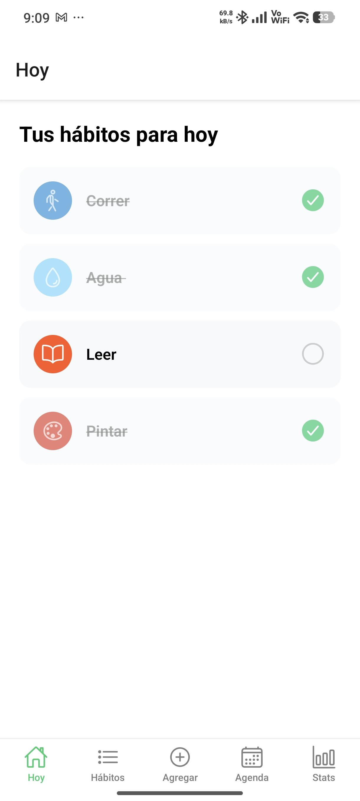
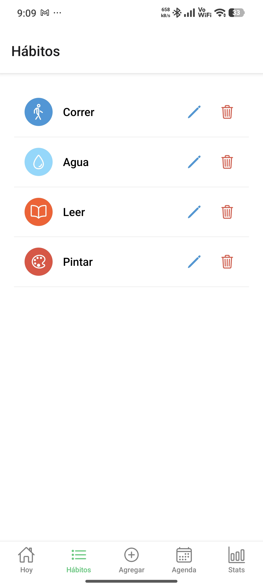
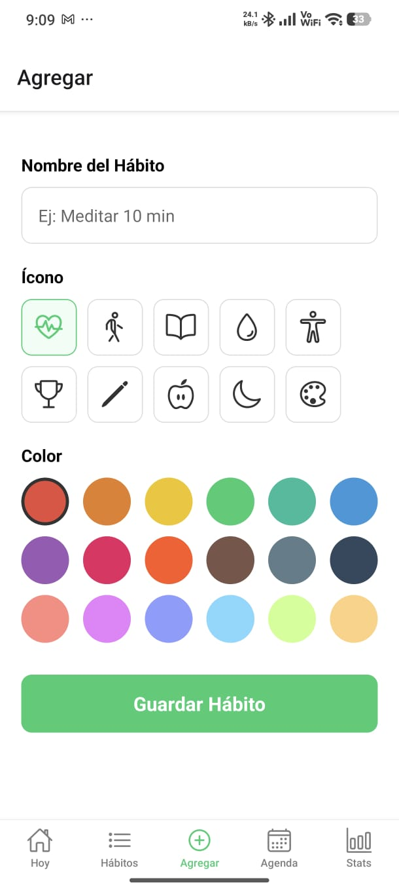
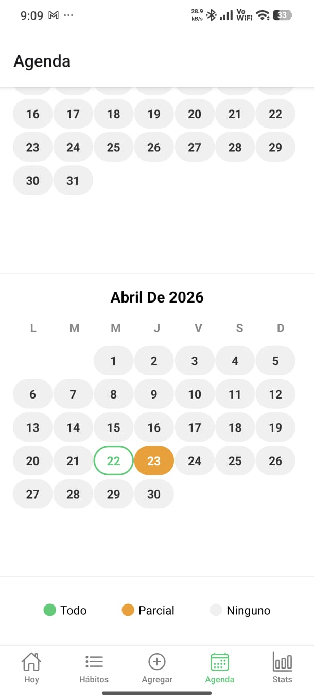
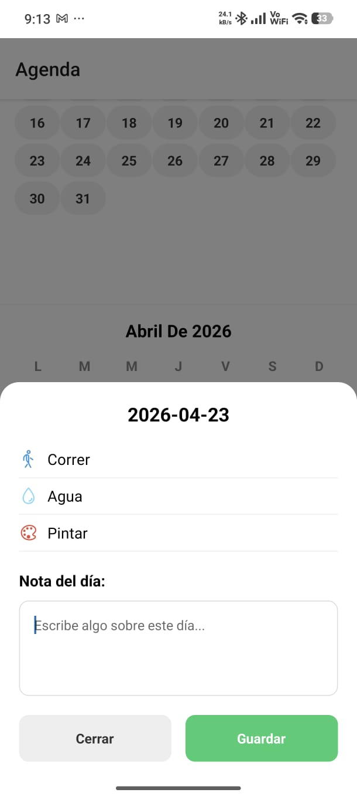
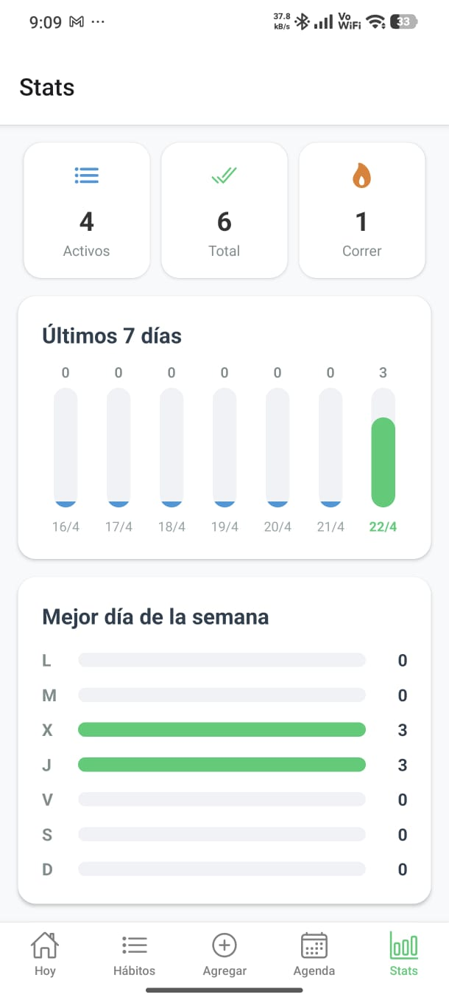

# HabitTracker


App móvil para tracking de hábitos diarios construida con React Native y Expo. Los usuarios crean hábitos personalizados, los marcan como completados cada día y visualizan su progreso a lo largo del tiempo.

## Screenshots

| Inicio | Lista de hábitos | Agregar hábito |
|--------|-----------------|----------------|
|  |  |  |

| Calendario | Notas | Estadísticas |
|------------|-------|-------------|
|  |  |  |

## Stack

| Tecnología | Uso |
|-----------|-----|
| React Native | Framework mobile |
| Expo | Toolchain y build |
| AsyncStorage | Persistencia local |
| React Navigation | Navegación entre pantallas |
| Expo Vector Icons | Iconografía (Ionicons) |

## Funcionalidades

- Crear hábitos con nombre, ícono y color personalizados
- Marcar hábitos como completados por día
- Editar y eliminar hábitos con confirmación
- Calendario mensual con colores por nivel de cumplimiento
- Notas diarias en el calendario
- Estadísticas: racha actual, mejor racha, rendimiento 30 días
- Gráfico de últimos 7 días y mejor día de la semana
- Persistencia total con AsyncStorage

## Arquitectura

```
habit-tracker/
├── App.js                          # Stack + Tab navigator
├── src/
│   ├── context/
│   │   └── HabitsContext.jsx      # Estado global + AsyncStorage
│   ├── screens/
│   │   ├── HomeScreen.jsx         # Hábitos del día con checkboxes
│   │   ├── HabitsScreen.jsx       # CRUD de hábitos
│   │   ├── AddHabitScreen.jsx     # Crear hábito
│   │   ├── EditHabitScreen.jsx    # Editar hábito
│   │   ├── CalendarScreen.jsx     # Calendario con notas
│   │   └── StatsScreen.jsx        # Estadísticas y gráficos
│   └── storage/
│       └── habits.js              # Helpers AsyncStorage
```

## Decisiones técnicas

**AsyncStorage como única fuente de verdad:** La app no necesita backend. Todos los datos viven en el dispositivo del usuario. El contexto sincroniza el estado en memoria con AsyncStorage en cada mutación, garantizando que los datos persistan entre sesiones.

**Context API sin Redux:** La app tiene un solo dominio de datos. Context API es suficiente y evita agregar complejidad innecesaria para un scope de este tamaño.

**Gráficos con View nativo:** Los gráficos de barras se construyen con componentes View y height proporcional en lugar de librerías externas. Elimina dependencias y demuestra comprensión del layout de React Native.

**Ionicons sobre emojis:** Se usa @expo/vector-icons para toda la iconografía. Los íconos vectoriales escalan correctamente en cualquier densidad de pantalla con comportamiento consistente entre Android e iOS.

**Navegación Stack + Tab:** El Tab Navigator maneja las 5 pantallas principales. La pantalla de edición vive en un Stack Navigator padre para evitar que aparezca en la barra de tabs, patrón estándar en apps React Native.

## Instalación

### Requisitos

- Node.js 18+
- Expo Go en tu dispositivo (Android o iOS)

### Pasos

```bash
git clone https://github.com/Buildirnite/habit-tracker.git
cd habit-tracker
npm install
npx expo start --tunnel
```

Escanea el QR con Expo Go en tu celular.

## Autor

**Buildirnite** · [github.com/Buildirnite](https://github.com/Buildirnite)

---
